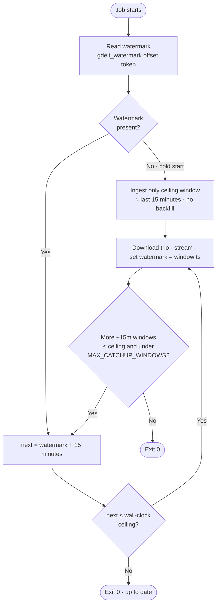
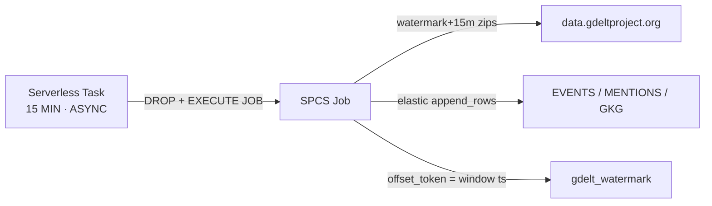
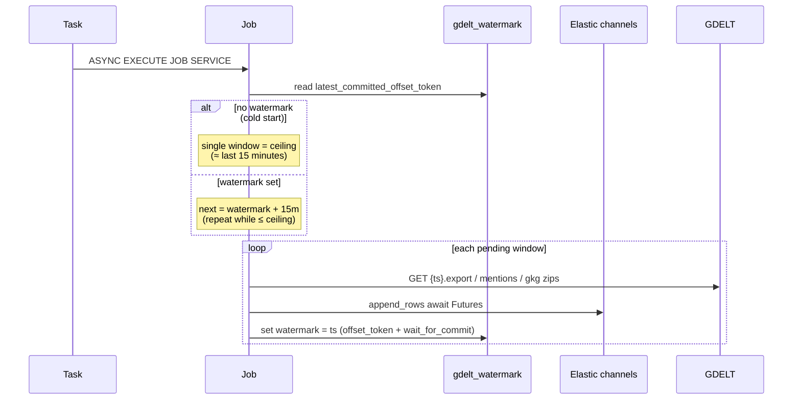

# GDELT Incremental Loader (SPCS Job)

Incremental loader for [GDELT 2.0](http://data.gdeltproject.org/gdeltv2/) that
runs **entirely inside Snowflake** as a **Snowpark Container Services (SPCS)
job**, triggered by a Snowflake **Task every 15 minutes** — matching GDELT's
own 15-minute publish cadence. Each run pulls the next `events` / `mentions` /
`gkg` window after the last watermark and streams rows into Snowflake with the
**Snowpipe Streaming SDK for Python** (`snowpipe-streaming`).

This is a lean companion to [`../streaming_gdelt`](../streaming_gdelt) (a
Locust-based *bulk historical* loader) and reuses its Snowflake object
conventions (row schema, `ROW_TIMESTAMP` latency tracking,
`MATCH_BY_COLUMN_NAME` pipes) and SPCS patterns from
[`../snowcat-elastic_channels`](../snowcat-elastic_channels). There is no
Locust, no Rust encoder, and no long-running service — just a small container
that runs one ingest cycle and exits.

## Architecture & cost

See **[docs/architecture-and-cost.md](./docs/architecture-and-cost.md)** for full
diagrams, measured volumes, and a monthly cost estimate (~**$67/month** at
Enterprise on-demand $3/credit).

### How windows are chosen



URLs are built as `{GDELT_BASE_URL}/{YYYYMMDDHHMMSS}.{export|mentions|gkg}…`.
The loader does **not** use `lastupdate.txt` or `masterfilelist.txt`.





1. A **serverless Snowflake Task** (`GDELT_INCREMENTAL_TASK`) fires every 15
   minutes, drops any prior named job, then runs `EXECUTE JOB SERVICE …
   ASYNC = TRUE` — the task finishes as soon as the job is accepted (~3–4s).
   Named jobs linger after `DONE`, so the DROP is required for the next run
   to recreate `GDELT_INCREMENTAL_JOB`.
2. The container (`main.py`) reads the watermark from a **standard** channel's
   `latest_committed_offset_token`:
   - **Cold start** (empty channel): ingest **only** the wall-clock ceiling
     window (~last 15 minutes). No historical backfill.
   - **Otherwise**: next window is **watermark + 15 minutes**. Catch-up is
     successive `+15m` steps capped by `MAX_CATCHUP_WINDOWS`. A wall-clock
     ceiling (`floor(UTC) − GDELT_LATEST_LAG_WINDOWS`) blocks unpublished
     windows. Missing files return 404 and are skipped.
3. For each pending window it downloads the three zips, decodes the
   tab-delimited rows, and appends them via one **elastic channel per table**,
   awaiting each append Future.
4. After a window's elastic appends are acknowledged, the watermark is set to
   **that window's timestamp** (`offset_token=<YYYYMMDDHHMMSS>` +
   `wait_for_commit`). The next run starts at watermark + 15 minutes.
5. The container closes its streaming clients and exits 0 — SPCS marks the job
   `DONE` (the serverless task already succeeded when the async job was accepted).

### Why a Task + `EXECUTE JOB SERVICE`, not a long-running `CREATE SERVICE`

SPCS **jobs** (`EXECUTE JOB SERVICE`) run a container to completion and exit,
which fits "do a batch of work every 15 minutes" — the compute pool only needs
to be resumed while a job is running (`AUTO_SUSPEND_SECS` reclaims it between
runs). A long-running `CREATE SERVICE` would need its own scheduler and stay
resident (and billed) the whole time for no benefit here.

### Auth: no private key needed in production

Inside the SPCS job container, Snowflake provides `SNOWFLAKE_ACCOUNT` /
`SNOWFLAKE_HOST` and mounts a short-lived OAuth session token at
`/snowflake/session/token`. `gdelt_incremental/config.py` detects this
(`AUTHORIZATION_TYPE=SPCS`) — the running job needs **no secret, no key-pair,
no password, and no warehouse**. Key-pair/password auth (`.env`) is only for
one-time local setup scripts.

## Project layout

```
gdelt_incremental/
  config.py          Environment-driven settings + SPCS/JWT auth switch
  schemas.py          BigQuery-aligned column definitions + DDL helpers
  gdelt_client.py      watermark+15m windows, URL construction, download
  row_encoder.py       Tab-delimited zip → row dicts for append_rows()
  watermark.py         Standard-channel offset-token get/set (no warehouse SQL)
  ingest.py             One cycle: next window(s) → stream → set watermark
main.py                 Entrypoint: run_once() then exit
sql/
  setup_snowflake.sql    Database/schema/compute pool/image repo/EAI/grants
  create_task.sql         CREATE TASK … AS EXECUTE JOB SERVICE … (every 15 min)
spcs/
  job_spec.yaml           SPCS job container spec (templated)
scripts/
  setup_snowflake_keypair.py  One-time: register an RSA key for local/dev auth
  create_gdelt_tables.py      Drop+recreate tables/pipes (full reset) + WM sink
  render_sql.py               Fill in sql/*.sql placeholders from .env
  deploy.sh                   Build/push the image, render job spec
```

## Quick start

### 1. Configure environment

```bash
cp .env.example .env
# Edit .env with your Snowflake account, database, and role.
```

### 2. One-time Snowflake setup (as ACCOUNTADMIN)

```bash
set -a && source .env && set +a
pip install -r requirements.txt
python scripts/render_sql.py
# Review sql/setup_snowflake.rendered.sql, then run it (Snowsight, SnowSQL, or `snow sql -f`)
```

Creates the database/schema, a 1-node compute pool, an image repository, a
stage, and the network rule / external access integration for outbound GDELT +
Snowflake ingest traffic.

### 3. Register a key pair and create tables (local dev auth)

```bash
python scripts/setup_snowflake_keypair.py --write-env
python scripts/create_gdelt_tables.py
```

**Drops and recreates** `EVENTS`, `EVENTMENTIONS`, `GKG`, `GDELT_WATERMARK`,
and their `MATCH_BY_COLUMN_NAME` pipes (clears streaming channel offset tokens
too). Progress lives on the `gdelt_watermark` channel offset token; the sink
table is only the pipe COPY target. Omit `SEED_WATERMARK_TIMESTAMP` so the
first job cold-starts from the latest ~15-minute window only.

### 4. Try one cycle locally (optional, uses key-pair auth from `.env`)

```bash
python main.py
```

First run with an empty watermark ingests only the ceiling window (~last 15
minutes). Later runs take watermark + 15 minutes.

### 5. Build, push, and deploy to SPCS

```bash
chmod +x scripts/deploy.sh
./scripts/deploy.sh
```

Builds the image, pushes it to the Snowflake image repository, and renders
`spcs/job_spec.rendered.yaml`. Then `PUT` that file to the stage (see script
output) and apply `sql/create_task.rendered.sql`.

### 6. Schedule the job every 15 minutes

```bash
python scripts/render_sql.py   # if not already run
# Review sql/create_task.rendered.sql, then run it
```

Creates and resumes `GDELT_INCREMENTAL_TASK`. To run once immediately:

```sql
EXECUTE TASK <database>.GDELT.GDELT_INCREMENTAL_TASK;
```

## Operating

```sql
-- Task run history
SELECT * FROM TABLE(INFORMATION_SCHEMA.TASK_HISTORY(
  TASK_NAME => 'GDELT_INCREMENTAL_TASK')) ORDER BY SCHEDULED_TIME DESC;

-- Job container logs
CALL SYSTEM$GET_SERVICE_LOGS('<database>.GDELT.GDELT_INCREMENTAL_JOB', 0, 'gdelt-incremental-job');

-- Sink rows (audit only; source of truth is the channel offset token)
SELECT * FROM <database>.GDELT.GDELT_WATERMARK ORDER BY LAST_TIMESTAMP DESC LIMIT 20;

-- Windows actually loaded
SELECT "_GDELT_TIMESTAMP", COUNT(*) FROM <database>.GDELT.EVENTS GROUP BY 1 ORDER BY 1;

-- Pause / resume the 15-minute schedule
ALTER TASK <database>.GDELT.GDELT_INCREMENTAL_TASK SUSPEND;
ALTER TASK <database>.GDELT.GDELT_INCREMENTAL_TASK RESUME;
```

### Reset everything (empty tables + clear watermark)

```bash
set -a && source .env && set +a
python scripts/create_gdelt_tables.py   # DROP + recreate tables/pipes
./scripts/deploy.sh                     # rebuild/push if code changed
# PUT job_spec + EXECUTE TASK …
```

### Ingest latency

Same convention as `../streaming_gdelt`: `client_ts_ms` is set when the job
appends a row, and `ROW_TIMESTAMP = TRUE` lets you compare it to Snowflake's
commit time.

```sql
SELECT
  "GLOBALEVENTID",
  "_GDELT_TIMESTAMP",
  TIMESTAMPDIFF(
    'second',
    TO_TIMESTAMP_NTZ("client_ts_ms", 3),
    METADATA$ROW_LAST_COMMIT_TIME
  ) AS ingest_latency_sec
FROM <database>.GDELT.EVENTS
WHERE METADATA$ROW_LAST_COMMIT_TIME IS NOT NULL
ORDER BY METADATA$ROW_LAST_COMMIT_TIME DESC
LIMIT 100;
```

## Configuration reference

| Variable | Default | Description |
|----------|---------|-------------|
| `SNOWFLAKE_DATABASE` | *(required)* | Target database |
| `SNOWFLAKE_SCHEMA` | `GDELT` | Dedicated schema for all objects |
| `SNOWFLAKE_WAREHOUSE` | *(optional)* | Local setup scripts only, not the job |
| `SNOWFLAKE_ROLE` | `GDELT_LOADER_ROLE` | Role the job/task run as |
| `SNOWFLAKE_TABLE_EVENTS` / `_MENTIONS` / `_GKG` | `EVENTS` / `EVENTMENTIONS` / `GKG` | Target table names |
| `SNOWFLAKE_WATERMARK_TABLE` | `GDELT_WATERMARK` | Streaming sink for watermark rows |
| `SNOWFLAKE_WATERMARK_CHANNEL` | `gdelt_watermark` | Standard channel; offset token = progress |
| `GDELT_BASE_URL` | `http://data.gdeltproject.org/gdeltv2` | Base URL for per-window file URLs |
| `GDELT_LATEST_LAG_WINDOWS` | `1` | Completed windows behind wall-clock used as ceiling |
| `BATCH_SIZE` | `1000` | Rows per `append_rows()` call |
| `MAX_CATCHUP_WINDOWS` | `8` | Max `+15m` catch-up windows per job run |
| `SEED_WATERMARK_TIMESTAMP` | *(unset)* | Optional seed after recreate; omit for cold start |
| `APPEND_ROWS_MAX_RETRIES` | `5` | Retries for retryable Snowpipe Streaming errors |
| `AUTHORIZATION_TYPE` | auto-detected | `SPCS` (in-container), `JWT` (key-pair), or unset |

## Caveats / at-least-once semantics

If the job crashes *after* appending a window's rows but *before* the watermark
offset token commits (`wait_for_commit`), the next run re-ingests that window
(duplicate rows). Each row still carries `_GDELT_TIMESTAMP` and
`GLOBALEVENTID` / `GKGRECORDID`, so downstream de-duplication is straightforward,
e.g. `QUALIFY ROW_NUMBER() OVER (PARTITION BY GLOBALEVENTID ORDER BY client_ts_ms DESC) = 1`
on `EVENTS`.
