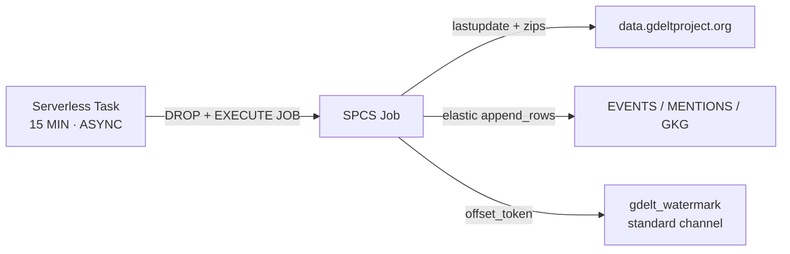
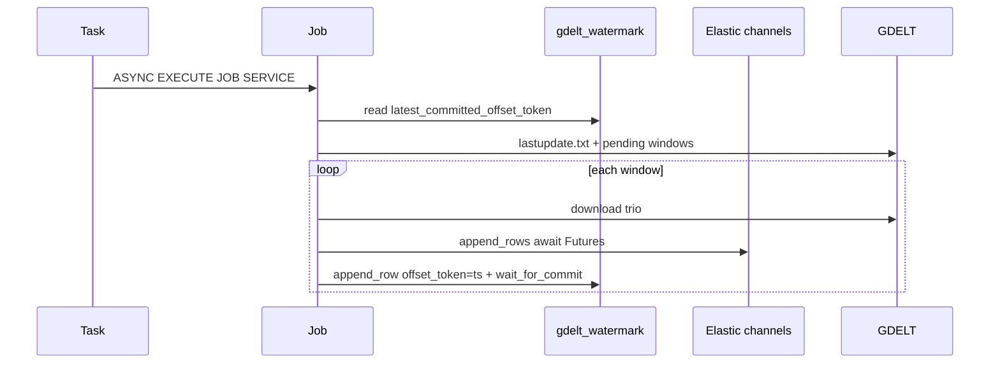

# GDELT Incremental Loader (SPCS Job)

Incremental loader for [GDELT 2.0](http://data.gdeltproject.org/gdeltv2/) that
runs **entirely inside Snowflake** as a **Snowpark Container Services (SPCS)
job**, triggered by a Snowflake **Task every 15 minutes** — matching GDELT's
own 15-minute publish cadence. Each run pulls only the new `events` /
`mentions` / `gkg` files since the last run and streams them into Snowflake
using the **Snowpipe Streaming SDK for Python** (`snowpipe-streaming`).

This is a lean, always-on companion to [`../streaming_gdelt`](../streaming_gdelt)
(a Locust-based *bulk historical* loader/load-tester) and reuses its
Snowflake object conventions (row schema, `ROW_TIMESTAMP` latency tracking,
`MATCH_BY_COLUMN_NAME` pipes) and its SPCS deployment conventions from
[`../snowcat-elastic_channels`](../snowcat-elastic_channels) (elastic-channel
Snowpipe Streaming usage, key-pair/SPCS-token auth switch). There is no
Locust, no Rust native encoder, and no long-running service here — just a
small container that runs one ingest cycle and exits.

## Architecture & cost

See **[docs/architecture-and-cost.md](./docs/architecture-and-cost.md)** for the full
architecture diagrams, measured GDELT volumes, and a monthly cost estimate
(~**$67/month** at Enterprise on-demand $3/credit: mostly SPCS, then serverless
task compute, with Snowpipe Streaming under $1 — no warehouse for watermark).





1. A **serverless Snowflake Task** (`GDELT_INCREMENTAL_TASK`) fires every 15
   minutes, drops any prior named job, then runs `EXECUTE JOB SERVICE …
   ASYNC = TRUE` — the task finishes as soon as the job is accepted (~3–4s).
   Named jobs linger after `DONE`, so the DROP is required for the next run
   to recreate `GDELT_INCREMENTAL_JOB`.
2. The container (`main.py`) reads the current watermark from a **standard**
   Snowpipe Streaming channel's `latest_committed_offset_token`, fetches
   [`lastupdate.txt`](http://data.gdeltproject.org/gdeltv2/lastupdate.txt) to
   find the newest available 15-minute window, and walks the predictable
   15-minute grid between the watermark and that window (capped by
   `MAX_CATCHUP_WINDOWS` so a long outage doesn't trigger an unbounded
   backfill in one run — any remaining gap closes gradually over subsequent
   15-minute runs).
3. For each pending window it downloads the three zips, decodes the
   tab-delimited rows, and appends them via one **elastic channel per table**
   (`StreamingIngestClient.get_elastic_channel()`), awaiting each append Future.
4. After a window's elastic appends are acknowledged, the watermark is advanced
   by appending a tiny row on the standard `gdelt_watermark` channel with
   `offset_token=<YYYYMMDDHHMMSS>` and `wait_for_commit`, so a mid-run failure
   resumes cleanly from the last fully-ingested window.
5. The container closes its streaming clients and exits 0 — SPCS marks the job
   `DONE` (the serverless task already succeeded when the async job was accepted).

### Why a Task + `EXECUTE JOB SERVICE`, not a long-running `CREATE SERVICE`

SPCS **jobs** (`EXECUTE JOB SERVICE`) run a container to completion and exit,
which is the right fit for "do a batch of work every 15 minutes" — the
compute pool only needs to be resumed while a job is actually running
(`AUTO_SUSPEND_SECS` on the pool reclaims it between runs). A long-running
`CREATE SERVICE` would need to build its own internal 15-minute scheduler
loop and stay resident (and billed) the whole time for no benefit here.

### Auth: no private key needed in production

Inside the SPCS job container, Snowflake automatically provides
`SNOWFLAKE_ACCOUNT`/`SNOWFLAKE_HOST` and mounts a short-lived OAuth session
token at `/snowflake/session/token`. `gdelt_incremental/config.py` detects
this (`AUTHORIZATION_TYPE=SPCS`) and uses it for the Snowpipe Streaming SDK —
so the running job needs **no secret, no key-pair, no password, and no
warehouse**. Key-pair/password auth (`.env`) is only used for one-time local
setup scripts.

## Project layout

```
gdelt_incremental/
  config.py          Environment-driven settings + SPCS/JWT/password auth switch
  schemas.py          BigQuery-aligned column definitions + DDL helpers
  gdelt_client.py      lastupdate.txt fetch, 15-minute window math, file download
  row_encoder.py       Tab-delimited zip -> row dicts for append_rows()
  watermark.py         Standard-channel offset-token get/set (no warehouse SQL)
  ingest.py             One incremental cycle: discover -> stream -> advance watermark
main.py                 Entrypoint: run_once() then exit (the job's whole lifecycle)
sql/
  setup_snowflake.sql    Database/schema/compute pool/image repo/EAI/grants
  create_task.sql         CREATE TASK ... AS EXECUTE JOB SERVICE ... (every 15 min)
spcs/
  job_spec.yaml           SPCS job container spec (templated)
scripts/
  setup_snowflake_keypair.py  One-time: register an RSA key for local/dev auth
  create_gdelt_tables.py      One-time: create EVENTS/EVENTMENTIONS/GKG + pipes + WM sink
  render_sql.py               Fill in sql/*.sql placeholders from .env
  deploy.sh                   Build/push the image, render + upload the job spec
```

## Quick start

### 1. Configure environment

```bash
cp .env.example .env
# Edit .env with your Snowflake account, database, and role.
```

### 2. One-time Snowflake setup (as ACCOUNTADMIN)

```bash
set -a && source .env && set +a
pip install -r requirements.txt
python scripts/render_sql.py
# Review sql/setup_snowflake.rendered.sql, then run it (Snowsight, SnowSQL, or `snow sql -f`)
```

This creates the database/schema, a 1-node compute pool, an image repository,
a stage, and the network rule/external access integration for outbound GDELT +
Snowflake ingest traffic.

### 3. Register a key pair and create tables (local dev auth)

```bash
python scripts/setup_snowflake_keypair.py --write-env
python scripts/create_gdelt_tables.py
```

Creates `EVENTS`, `EVENTMENTIONS`, `GKG` (with `ROW_TIMESTAMP = TRUE`), their
`MATCH_BY_COLUMN_NAME` Snowpipe Streaming pipes, and the `GDELT_WATERMARK`
streaming sink + pipe. Progress is stored as the `gdelt_watermark` channel's
offset token (the sink table is only the pipe COPY target).

### 4. Try one cycle locally (optional, uses key-pair auth from `.env`)

```bash
python main.py
```

First run ingests only the latest published window (no backfill by design);
subsequent runs pick up from the watermark.

### 5. Build, push, and deploy to SPCS

```bash
chmod +x scripts/deploy.sh
./scripts/deploy.sh
```

Builds the image, pushes it to the Snowflake image repository, and renders +
uploads `spcs/job_spec.yaml` to the stage.

### 6. Schedule the job every 15 minutes

```bash
python scripts/render_sql.py   # if not already run
# Review sql/create_task.rendered.sql, then run it
```

This creates and resumes `GDELT_INCREMENTAL_TASK`. To run it once immediately
instead of waiting for the schedule:

```sql
EXECUTE TASK <database>.GDELT.GDELT_INCREMENTAL_TASK;
```

## Operating

```sql
-- Task run history
SELECT * FROM TABLE(INFORMATION_SCHEMA.TASK_HISTORY(
  TASK_NAME => 'GDELT_INCREMENTAL_TASK')) ORDER BY SCHEDULED_TIME DESC;

-- Job container logs
CALL SYSTEM$GET_SERVICE_LOGS('<database>.GDELT.GDELT_INCREMENTAL_JOB', 0, 'gdelt-incremental-job');

-- Sink rows (audit only; source of truth is the channel offset token)
SELECT * FROM <database>.GDELT.GDELT_WATERMARK ORDER BY LAST_TIMESTAMP DESC LIMIT 20;

-- Pause / resume the 15-minute schedule
ALTER TASK <database>.GDELT.GDELT_INCREMENTAL_TASK SUSPEND;
ALTER TASK <database>.GDELT.GDELT_INCREMENTAL_TASK RESUME;
```

### Ingest latency

Same convention as `../streaming_gdelt`: `client_ts_ms` is set when the job
appends a row, and `ROW_TIMESTAMP = TRUE` lets you compare it to Snowflake's
own commit time.

```sql
SELECT
  "GLOBALEVENTID",
  "_GDELT_TIMESTAMP",
  TIMESTAMPDIFF(
    'second',
    TO_TIMESTAMP_NTZ("client_ts_ms", 3),
    METADATA$ROW_LAST_COMMIT_TIME
  ) AS ingest_latency_sec
FROM <database>.GDELT.EVENTS
WHERE METADATA$ROW_LAST_COMMIT_TIME IS NOT NULL
ORDER BY METADATA$ROW_LAST_COMMIT_TIME DESC
LIMIT 100;
```

## Configuration reference

| Variable | Default | Description |
|----------|---------|--------------|
| `SNOWFLAKE_DATABASE` | *(required)* | Target database |
| `SNOWFLAKE_SCHEMA` | `GDELT` | Dedicated schema for all objects |
| `SNOWFLAKE_WAREHOUSE` | *(optional)* | Only for local setup scripts, not the job |
| `SNOWFLAKE_ROLE` | `GDELT_LOADER_ROLE` | Role the job/task run as |
| `SNOWFLAKE_TABLE_EVENTS` / `_MENTIONS` / `_GKG` | `EVENTS` / `EVENTMENTIONS` / `GKG` | Target table names |
| `SNOWFLAKE_WATERMARK_TABLE` | `GDELT_WATERMARK` | Streaming sink for watermark rows |
| `SNOWFLAKE_WATERMARK_CHANNEL` | `gdelt_watermark` | Standard channel whose offset token is progress |
| `LASTUPDATE_URL` | GDELT `lastupdate.txt` | Incremental index source |
| `GDELT_BASE_URL` | `http://data.gdeltproject.org/gdeltv2` | Base URL for constructing per-window file URLs |
| `BATCH_SIZE` | `1000` | Rows per `append_rows()` call |
| `MAX_CATCHUP_WINDOWS` | `8` | Max 15-minute windows caught up on in a single run |
| `APPEND_ROWS_MAX_RETRIES` | `5` | Retries for retryable Snowpipe Streaming errors |
| `AUTHORIZATION_TYPE` | auto-detected | `SPCS` (in-container), `JWT` (key-pair), or unset to auto-detect |

## Caveats / at-least-once semantics

If the job process crashes *after* successfully appending a window's rows
but *before* the watermark offset token commits (`wait_for_commit`), the next
run will re-ingest that same window, producing duplicate rows (each row still
carries `_GDELT_TIMESTAMP` and the original `GLOBALEVENTID`/`GKGRECORDID`, so
downstream de-duplication is straightforward, e.g. `QUALIFY
ROW_NUMBER() OVER (PARTITION BY GLOBALEVENTID ORDER BY client_ts_ms DESC) = 1`
on `EVENTS`). This mirrors the semantics of the underlying Snowpipe Streaming
SDK and was chosen over more complex exactly-once bookkeeping to keep the job
simple enough to reason about at a 15-minute cadence.
