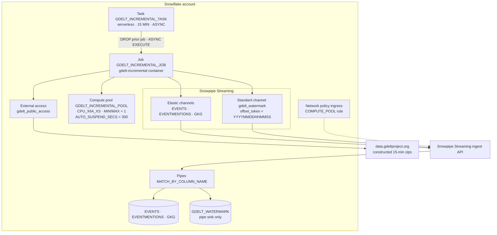
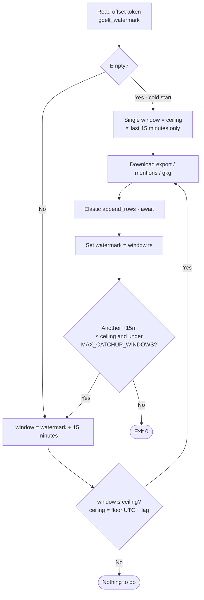
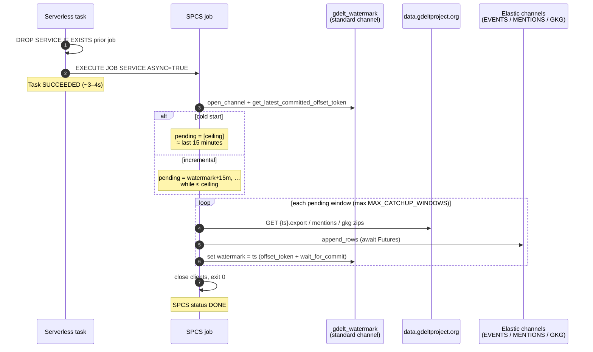

# Architecture & Monthly Cost Estimate

This document describes the production architecture of the GDELT incremental
loader and a bottom-up monthly cost estimate for the deployment currently
running in `SC_DB.GDELT` on account `SFPRODUCTSTRATEGY-SC_ZPXQFMGOHT`
(Enterprise edition, AWS `us-west-2`).

Rates are taken from the [Snowflake Service Consumption Table](https://www.snowflake.com/legal-files/CreditConsumptionTable.pdf)
(effective July 24, 2026). Dollar amounts use an **on-demand Enterprise**
platform-credit price of **$3.00/credit** (typical US AWS list; capacity
contracts are lower). Serverless task compute is billed at the Consumption
Table **Serverless Task** multiplier (~**1.5×** warehouse-equivalent hours
for actual runtime — no 60-second warehouse floor on the task itself).

## Architecture

### System overview



### Window discovery & watermark

Progress is entirely watermark-driven. File URLs are constructed from the
15-minute timestamp — **no** `lastupdate.txt` and **no** `masterfilelist.txt`
(those indexes can lag or omit windows; the bulk loader in `../streaming_gdelt`
uses the masterfilelist for historical backfill instead).



| Mode | Next window(s) | Watermark after success |
|------|----------------|-------------------------|
| Cold start (no offset token) | Exactly one: wall-clock ceiling | That window's `YYYYMMDDHHMMSS` |
| Steady state | `watermark + 15m` (repeat while ≤ ceiling) | Each completed window's timestamp |
| Catch-up after outage | Successive `+15m` up to `MAX_CATCHUP_WINDOWS` | Advanced per completed window |

`GDELT_LATEST_LAG_WINDOWS` (default `1`) steps the ceiling back from
`floor(UTC now)` so the job does not race a window GDELT has not published yet.
Upstream `404` for a table/window is treated as empty and skipped.

### Per-run sequence



### Channel model

| Concern | Channel type | Pipe / table | How progress / data is tracked |
|---------|--------------|--------------|--------------------------------|
| EVENTS / EVENTMENTIONS / GKG | **Elastic** | `*_MATCH_BY_COLUMN` → fact tables | Row payload only (no offset tokens) |
| Watermark | **Standard** (`gdelt_watermark`) | `GDELT_WATERMARK_MATCH_BY_COLUMN` → sink | `latest_committed_offset_token` = last ingested `YYYYMMDDHHMMSS` |

The sink table exists only because a streaming pipe needs a COPY target. The
loader never runs warehouse SQL to read or write watermark state.

### Runtime loop (every 15 minutes)

1. Serverless task wakes, `DROP SERVICE IF EXISTS` the prior named job (DONE
   jobs linger and otherwise block recreate), then `EXECUTE JOB SERVICE …
   ASYNC = TRUE`. Task run finishes in a few seconds once the job is accepted
   (measured ~3–4s).
2. Compute pool resumes from `SUSPENDED` if needed (`STARTING` is not billed;
   resume carries a **5-minute platform-credit minimum** per the consumption
   table).
3. Container authenticates with the mounted SPCS session token — no private
   key and **no warehouse**.
4. Opens standard channel `gdelt_watermark`, reads
   `get_latest_committed_offset_token()`:
   - empty → cold start: **one** ceiling window (~last 15 minutes)
   - else → **watermark + 15 minutes** (catch-up capped by ceiling +
     `MAX_CATCHUP_WINDOWS`)
5. For each pending window: download export/mentions/gkg → decode →
   `append_rows` on three elastic channels (await Futures) → **set watermark
   to that window's timestamp** (`offset_token=<ts>` + `wait_for_commit`).
6. Container exits 0; pool idles until `AUTO_SUSPEND_SECS` (300s today), then
   suspends.

### Why this shape is cheap vs a long-running service

A `CREATE SERVICE` that slept between windows would keep the compute-pool node
**IDLE/ACTIVE 24×7** (~720 hours × 0.06 cr/hr ≈ **43 credits/month** for SPCS
alone). The job model only bills while the node is up around each 15-minute
run. Tracking progress on a streaming channel offset token also removes the
former **`QUERY_WAREHOUSE` 60-second resume tax** (~$144/month at list).

## Volume baseline (measured)

Cold-start verification run on **2026-07-27** for window `20260727204500`
(single window only; empty watermark after table reset):

| File | Rows loaded |
|------|-------------|
| export (events) | 1,179 |
| mentions | 3,609 |
| gkg | 1,628 |
| **Per window** | **~6.4k** |

Earlier size sample for a typical window the same day:

| File | Compressed zip | Uncompressed CSV | Est. NDJSON to SDK | Rows |
|------|----------------|------------------|--------------------|------|
| export (events) | 0.08 MB | 0.48 MB | ~0.96 MB | ~1.2k |
| mentions | 0.14 MB | 0.85 MB | ~1.6 MB | ~4.1k |
| gkg | 6.6 MB | 20.6 MB | ~23.7 MB | ~1.5k |
| **Per window** | **~6.8 MB** | **~21.9 MB** | **~26.2 MB (0.026 GB)** | **~6.8k** |

Cadence: **96 windows/day** × 30 ≈ **2,880 runs/month**.

| Horizon | Uncompressed NDJSON (ingest-metered) |
|---------|--------------------------------------|
| Day | ~2.5 GB |
| Month | **~76 GB** |

GKG dominates volume (~90% of NDJSON bytes). Window sizes vary with news
volume; treat ±50% as a reasonable band for busy/quiet months.

## Cost model

### Rate card used

| Component | Rate | Source |
|-----------|------|--------|
| SPCS `CPU_X64_XS` | **0.06** platform credits / node-hour | Consumption Table – SPCS first-gen |
| SPCS resume minimum | **5 minutes** of credits per start/resume | Consumption Table preamble |
| Serverless Task | **~1.5×** warehouse-equivalent for *actual* runtime | Consumption Table – Serverless Task |
| Snowpipe Streaming (HP / SSv2) | **0.0037** credits / uncompressed GB | Consumption Table – Snowpipe Streaming |
| Platform credit $ (Enterprise OD) | **$3.00** / credit | Typical US AWS on-demand list |

### Steady-state monthly estimate (current config)

Assumptions aligned with the deployed objects:

- 2,880 job runs/month (exactly one 15-minute window each, no catch-up backlog)
- Serverless task body ~**4 seconds** (DROP + async EXECUTE accept)
- Job wall time ~1 minute of ACTIVE work once the node is up
- `AUTO_SUSPEND_SECS = 300` → ~5 minutes IDLE after each job before suspend
- Billed SPCS time per cycle ≈ `max(5 min resume minimum, 1 + 5) = **6 minutes**`
- **No warehouse** for watermark (standard-channel offset token)
- Ingest = 76 GB/month uncompressed NDJSON at 0.0037 cr/GB

| Cost center | Formula | Credits / mo | $ / mo @ $3/cr | Share |
|-------------|---------|--------------|----------------|-------|
| **SPCS compute pool** | 2,880 × 6 min × 0.06 cr/hr | **17.3** | **$52** | 77% |
| **Serverless task** | 2,880 × 4s × 1.5 × 1.0 cr/hr | **4.8** | **$14** | 21% |
| **Snowpipe Streaming ingest** | 76 GB × 0.0037 | **0.28** | **$0.84** | 1% |
| **Total** | | **~22.4** | **~$67** | 100% |

Storage growth for ~76 GB/month of *uncompressed* input is much smaller on
disk after columnar compression (order of a few–tens of GB/month). At
~$23/TB-month that is **well under $1/month** and is omitted from the total
above. Cloud Services usually stays under the 10% daily warehouse allowance.

### Sensitivity

| Scenario | SPCS cr | Serverless cr | Ingest cr | Total $ |
|----------|---------|---------------|-----------|---------|
| Current (`AUTO_SUSPEND=300`) | 17.3 | 4.8 | 0.28 | **~$67** |
| `AUTO_SUSPEND_SECS=60` (5-min SPCS floor still binds) | 14.4 | 4.8 | 0.28 | **~$58** |
| Quiet news month (−50% GKG bytes) | 17.3 | 4.8 | 0.14 | **~$67** |
| Busy news month (+50% GKG bytes) | 17.3 | 4.8 | 0.42 | **~$68** |
| Always-on `CREATE SERVICE` instead of jobs | ~43 | 0 | 0.28 | **~$130+** |

### What actually dominates cost

**Ingest is negligible** (~$1/month). Almost all spend is the **SPCS
5-minute resume minimum** every 15 minutes, then a small serverless-task
charge for DROP/EXECUTE. Removing warehouse SQL for the watermark cut the
previous ~$144/month `QUERY_WAREHOUSE` term.

## Optimization levers (ranked)

1. **`AUTO_SUSPEND_SECS = 60`** on `GDELT_INCREMENTAL_POOL` — shaves ~1 minute
   of IDLE off each cycle; limited by the 5-minute resume floor (~$9/month).
2. **Do not** move to a long-running service for cost reasons; idle SPCS alone
   is ~$130/month at list.

## How to verify against the bill

```sql
-- SPCS credits
SELECT DATE_TRUNC('day', start_time) d, SUM(credits_used) cr
FROM SNOWFLAKE.ACCOUNT_USAGE.METERING_HISTORY
WHERE service_type = 'SNOWPARK_CONTAINER_SERVICES'
  AND start_time >= DATEADD('day', -30, CURRENT_TIMESTAMP())
GROUP BY 1 ORDER BY 1;

-- Serverless task credits
SELECT DATE_TRUNC('day', start_time) d, SUM(credits_used) cr
FROM SNOWFLAKE.ACCOUNT_USAGE.SERVERLESS_TASK_HISTORY
WHERE task_name = 'GDELT_INCREMENTAL_TASK'
  AND start_time >= DATEADD('day', -30, CURRENT_TIMESTAMP())
GROUP BY 1 ORDER BY 1;

-- Snowpipe Streaming (high-performance) volume / credits
SELECT DATE_TRUNC('day', start_time) d,
       SUM(credits_used) cr
FROM SNOWFLAKE.ACCOUNT_USAGE.METERING_HISTORY
WHERE service_type ILIKE '%SNOWPIPE%STREAM%'
  AND start_time >= DATEADD('day', -30, CURRENT_TIMESTAMP())
GROUP BY 1 ORDER BY 1;

-- Task run durations (should be a few seconds with ASYNC=TRUE)
SELECT AVG(DATEDIFF('second', query_start_time, completed_time)) avg_sec,
       COUNT(*) runs
FROM TABLE(INFORMATION_SCHEMA.TASK_HISTORY(
  TASK_NAME => 'GDELT_INCREMENTAL_TASK',
  SCHEDULED_TIME_RANGE_START => DATEADD('day', -7, CURRENT_TIMESTAMP())
))
WHERE STATE = 'SUCCEEDED';
```

## Object inventory (deployed)

| Object | Name |
|--------|------|
| Database / schema | `SC_DB.GDELT` |
| Fact tables | `EVENTS`, `EVENTMENTIONS`, `GKG` |
| Watermark sink table | `GDELT_WATERMARK` (pipe target only; not SQL state) |
| Fact pipes | `EVENTS_MATCH_BY_COLUMN`, `EVENTMENTIONS_MATCH_BY_COLUMN`, `GKG_MATCH_BY_COLUMN` |
| Watermark pipe | `GDELT_WATERMARK_MATCH_BY_COLUMN` |
| Watermark channel | `gdelt_watermark` (offset token = progress) |
| Compute pool | `GDELT_INCREMENTAL_POOL` (`CPU_X64_XS`) |
| Image | `.../gdelt_loader_repo/gdelt-incremental:latest` |
| Job | `GDELT_INCREMENTAL_JOB` |
| Task | `GDELT_INCREMENTAL_TASK` (serverless, `15 MINUTE`, `ASYNC`, no `QUERY_WAREHOUSE`) |
| EAI | `gdelt_public_access` |
| Ingress rule | `SC_DB.SC_SCHEMA.GDELT_LOADER_POOL_INGRESS` |

### Reset inventory

`scripts/create_gdelt_tables.py` **DROPs and recreates** all fact tables,
pipes, and the watermark sink/pipe so streaming channel offset tokens are
cleared. With no `SEED_WATERMARK_TIMESTAMP`, the next job cold-starts from the
latest ~15-minute window only.
