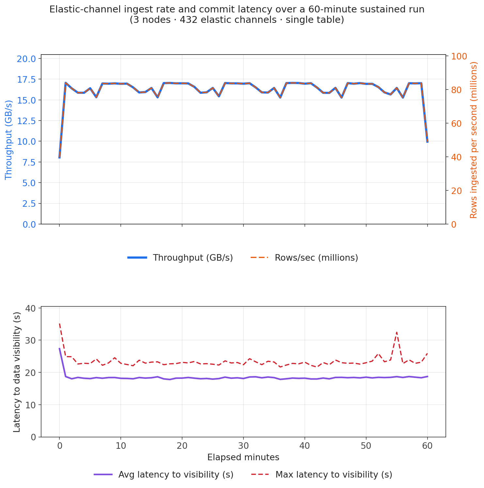

# Streaming at Scale, the Easy Way: Elastic Channels and Serverless Ingest on Snowflake

*A push-and-await API that scales to tens of gigabytes a second, and a production pipeline that never boots a VM you have to manage.*

by the SnowCAT team

---

**Summary**

- Snowpipe Streaming **elastic channels** sustained **17.0 GB/s** — roughly **84 million rows every second** — continuously for a full hour, using nothing but a simple `append_rows()` call with no channel naming or offset-token bookkeeping in application code.
- At matched configuration, elastic channels delivered **3.8× the throughput** of standard (named) channels and **3.65× lower commit latency**, with far less integration code required to use them.
- A production pipeline ingesting GDELT's global news-event feed every 15 minutes proves the same primitive at everyday scale — **entirely inside Snowflake**, using a Snowpark Container Services (SPCS) job plus a serverless Task. No Kubernetes cluster, no always-on VM to manage, and a total runtime cost of about **$67/month**.

Streaming data doesn't stop for your infrastructure roadmap. News wires publish every 15 minutes, IoT fleets emit continuously, clickstreams never pause for a maintenance window. The traditional answer — stand up Kafka, size the partitions, run a consumer cluster, keep all of it patched and paged — works, but it's a second platform bolted onto your data platform.

Snowflake's answer is Snowpipe Streaming: a push API that lands rows directly into a table, with commit acknowledgment in seconds. Recently, an easier way to use it arrived: **elastic channels**. Where standard (also called "traditional" or "named") channels require you to name a channel, persist its offset token, and reconcile that state across restarts, an elastic channel is anonymous, managed by the client, and returns a plain `Future` you await. Less code, and — as we measured — dramatically more throughput.

This post covers two things: how fast and how simple elastic channels really are at scale, and what it looks like to run a real, scheduled streaming pipeline entirely on Snowflake-managed compute — with no Kubernetes cluster anywhere in the picture.

## Elastic channels: scale without the bookkeeping

A **standard channel** is a named, stateful object. Your application assigns it a unique name, and for exactly-once delivery across restarts, your code must generate, persist, and check an **offset token** every time it resumes. `append_rows()` returns `None`; you poll `wait_for_commit` separately to know whether a batch actually landed.

An **elastic channel** (`client.get_elastic_channel()`) has none of that surface area. There's no name to assign, no offset token to persist, and `append_rows()` returns a `Future` that resolves when the batch commits — the same async-ack ergonomics you'd want from any modern streaming client.

| | Elastic channel | Standard (named) channel |
|---|---|---|
| Naming | None — auto-managed per client | Must assign and track a unique name |
| Offset tracking | None | Caller must generate, persist, and check offset tokens |
| `append_rows` return | `Future` (resolves on commit) | `None` — commit status polled separately |
| Integration effort | Works directly against a `Future`-based harness | Required a purpose-built ~50-line adapter to convert the synchronous, token-based API into the same interface |
| Lifecycle | Tied to the client — opens/closes implicitly | Explicit open/close; state must survive process restarts |

Standard channels aren't pointless — an explicit offset token is exactly what you want for a small, must-be-exact progress cursor (more on that below, where our GDELT pipeline uses one on purpose). But for the common case — "get these rows into this table as fast as possible" — elastic channels are simply less code. They're also, as the numbers below show, much faster.

## Proof: a 60-minute sustained run at scale

To stress Snowpipe Streaming fairly, throughput has to come from many independent producers, not one oversized client saturating its own network link before it pressures the service. We ran a fleet of EC2 clients, each running many worker processes, each worker opening its own elastic channel against the same table — and held it at a constant rate for a full hour, not just a short burst.

| Parameter | Value |
|---|---|
| Client nodes | 3 × `c9g.24xlarge` (AWS Graviton5) |
| Cores / memory per node | 96 vCPU / 192 GiB |
| Total cores / memory | 288 vCPU / 576 GiB |
| Elastic channels (SDK workers) | 144 per node × 3 nodes = **432 total** |
| Batch size | 4 MiB |
| Destination | Single unclustered table |
| Test duration | 60 minutes, sustained |
| Row shape | Synthetic `LIFT_RIDE` record, ~203 bytes/row |

**Results**

| Metric | Value |
|---|---|
| Rows ingested | 301.76 billion |
| Bytes ingested (uncompressed, wire) | 61.26 TB |
| Sustained throughput | **17.0 GB/s** aggregate |
| Rows ingested per second | ~84 million |
| Avg latency to data visibility | **~18.4s** |



*Top: ingestion rate over the full 60-minute run, aggregated per minute from the destination table's committed rows. Bottom: latency to data visibility over the same hour — the time from `append_rows()` to the row being queryable, measured against `METADATA$ROW_LAST_COMMIT_TIME`. Both hold flat for the entire run, with no drift as the hour goes on.*

Extrapolated (not run as an independent 24-hour test), 17.0 GB/s sustained works out to roughly **1.47 petabytes per day** to a single table — achieved here from just **3 physical client nodes** rather than a fleet of thousands of small producer pods, because elastic channels let a single process open many concurrent channels cheaply. Client-side headroom stayed comfortable throughout: row-generation CPU had ~6.6× headroom per worker, overall client CPU averaged 68.6% across 96 vCPUs, and the SDK's own input-buffer backpressure counter stayed at zero the entire run.

Just as important as the throughput number is that it held steady: average latency from append to data being queryable stayed close to **18.4 seconds** for the entire hour, with the max per-minute latency bouncing between roughly **22–35 seconds** and no upward drift as the run went on — the pipeline didn't degrade or fall behind under sustained load.

### Elastic vs. standard channels, head-to-head

The clearest result of the whole benchmark: at identical node count, worker count, and batch size, only the channel API differs.

| Metric | Elastic channels | Standard (named) channels | Ratio |
|---|---|---|---|
| Aggregate throughput | **20.37 GB/s** | 5.29 GB/s | 3.85× |
| Avg commit latency | 5.6s | 20.6s | 3.65× faster |
| Max commit latency | 8.5s | 75.2s | 8.86× faster |
| Batches committed (10 min) | 2,915,403 | 756,759 | 3.85× |

**Elastic channels are the clear default** for throughput-oriented ingestion: simpler code, and several times the throughput of standard channels at any channel count we tested.

## No Kubernetes required: running entirely inside Snowflake

The benchmark above proves the ingest primitive at large scale. A production pipeline we built for [GDELT 2.0](http://data.gdeltproject.org/gdeltv2/) — the global news-event feed, published every 15 minutes — proves the same primitive works just as well at everyday scale, and that the whole thing can live inside one Snowflake account with nothing else to operate.

```
GDELT_INCREMENTAL_TASK  (serverless task, SCHEDULE = '15 MINUTE')
  │
  ├─ DROP SERVICE IF EXISTS <prior job>       (named jobs linger after DONE)
  └─ EXECUTE JOB SERVICE ... ASYNC = TRUE      (task itself SUCCEEDS in ~3–4s)
        │
        ▼
GDELT_INCREMENTAL_JOB  (SPCS job, 1-node compute pool)
  │
  ├─ Reads watermark: gdelt_watermark (STANDARD channel) → latest_committed_offset_token
  │     empty  → cold start: ingest only the latest ~15-minute window
  │     present → next window = watermark + 15 minutes (repeat while ≤ ceiling)
  │
  ├─ For each pending window:
  │     download export / mentions / gkg zips over external access
  │     decode rows
  │     append_rows() on 3 ELASTIC channels (EVENTS, EVENTMENTIONS, GKG) — await Futures
  │     set watermark = window timestamp (offset_token + wait_for_commit)
  │
  └─ exit 0 → SPCS marks the job DONE → compute pool idles → auto-suspends
```

Every object in that diagram is Snowflake-native: a Task, a Job, a compute pool, an external access integration, three Snowpipe Streaming pipes. There is no Kubernetes control plane to patch, no node pool to size for peak and pay for at idle, no separate VPC or IAM boundary for compute — the whole surface lives inside one Snowflake account, under the same RBAC and network policy as the tables it writes to. The container itself authenticates with a short-lived OAuth session token that Snowflake mounts automatically — no private key, password, or secret anywhere in the image.

> **Why a job, not a long-running service.** An SPCS `CREATE SERVICE` that slept between windows would keep the compute-pool node resident 24×7. A job (`EXECUTE JOB SERVICE`) only bills for the brief window the container is actually up around each run — the pattern that fits "do a batch of work every 15 minutes" without needing a scheduler of its own.

### Elastic and standard channels, each doing what it's good at

This pipeline is a clean illustration of the two channel types dividing labor correctly instead of picking one for everything:

- **EVENTS / EVENTMENTIONS / GKG** (the actual news data) use **elastic channels** — high throughput, no bookkeeping, exactly matching the benchmark's findings.
- **`gdelt_watermark`** — a single logical cursor that must be exactly "the last window I successfully ingested" — uses a **standard channel** on purpose. Its `latest_committed_offset_token` *is* the progress state: no SQL table read, no warehouse query, just `get_latest_committed_offset_token()` at the top of every run.

### What it costs to run continuously

This pipeline runs 2,880 times a month, one 15-minute window each, ingesting around 76 GB of uncompressed data — and the entire runtime bill, covering the compute-pool time, the serverless task, and the streaming ingest itself, comes to about **$67/month**. There's no warehouse in the runtime path and no idle fleet sitting between runs; the compute pool resumes for each job and suspends immediately after.

## Elastic channels vs. standard channels: the takeaway

Across both the benchmark and the production pipeline, the pattern is consistent:

- **Use elastic channels by default.** They need no name, no offset-token plumbing, return a `Future` you can await directly, and — in every configuration tested — deliver several times the throughput of standard channels at the same worker count.
- **Reach for a standard channel only when you need its offset token as your actual application state** — a resumable cursor that must be exact across restarts, like GDELT's 15-minute watermark. That's a deliberate, small-scope use of the extra bookkeeping standard channels require, not a default.
- **Both run without a warehouse and without Kubernetes.** Whether you're pushing 17 GB/s from a benchmark fleet or a few hundred kilobytes every 15 minutes from a single SPCS job, the ingest path is the same push-and-await API, backed entirely by Snowflake-managed compute.

## What's next

- Push the node-count scaling test further and explore spreading writers across multiple destination tables/pipes for even higher aggregate throughput.
- The GDELT loader is a template: any 15-minute-or-slower public feed can be pointed at the same SPCS-job-plus-Task pattern with no new infrastructure, just a new container image and pipe definitions.

---

*Full benchmark harness, cost model, and architecture diagrams are available in the project repositories, including the raw per-run data behind every number above.*
